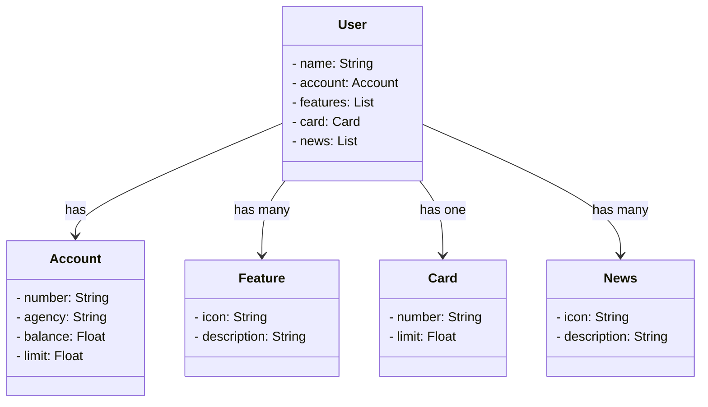

# Santander Dev Week 20023

## Diagrama de Classes:

```mermaid
classDiagram 
  class User {
    - name: String
    - account: Account
    - features: List<Feature>
    - card: Card
    - news: List<News>
  }

  class Account {
    - number: String
    - agency: String
    - balance: Float
    - limit: Float
  }

  class Feature {
    - icon: String
    - description: String
  }

  class Card {
    - number: String
    - limit: Float
  }

  class News {
    - icon: String
    - description: String
  }

  User --> Account : has
  User --> Feature : has many
  User --> Card : has one
  User --> News : has many
```

